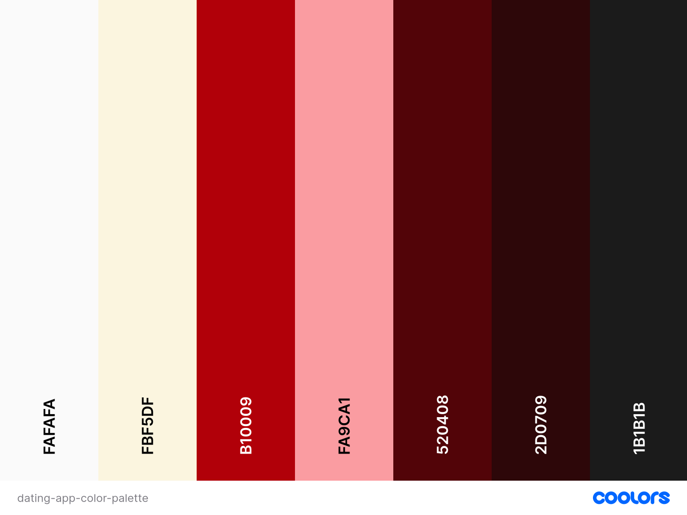

# Love.exe – Coding Connections in the Digital Age 🌈!

# ***SparkSync***

## **Table of Contents**
* [**SparkSync**](#sparksync)
* [**About the Submission**](#about-the-submission)
    + [**Deployment**](#deployment)
    + [**Goal**](#goal)
    + [**Problem Statement**](#problem-statement)
    + [**Objective(s)**](#objectives)
    + [**Target Audience**](#target-audience)
* [**Pages**](#pages)
* [**Tech Stack**](#tech-stack)
    + [**Languages & Frameworks**](#languages--frameworks)
    + [**Database**](#database)
    + [**Authentication**](#authentication)
    + [**Styling & Fonts**](#styling--fonts)
    + [**Real-time Features**](#real-time-features)
    + [**Deployment & Services**](#deployment--services)
    + [**Development Tools**](#development-tools)
    + [**Additional Libraries**](#additional-libraries)
    + [**Email Provider**](#email-provider)
* [**Design**](#design)
    + [**Color Palette**](#color-palette)
    + [**Typography**](#typography)
* [**Future Development**](#future-development)
    + [**Enhanced Matching Algorithm**](#future-development)
    + [**Advanced Communication Features**](#advanced-communication-features)
    + [**Profile Enhancements**](#profile-enhancements)
    + [**Safety & Privacy**](#safety--privacy)
    + [**User Experience**](#user-experience)
    + [**Premium Features**](#premium-features)
    + [**Community Features**](#community-features)
* [**Credits**](#credits)
* [**Testing**](#testing)
* [**Team**](#team)

## **About the Submission**  

### **Intro**
SparkSync is a modern dating application designed to help people form meaningful connections through shared interests, preferences, and compatibility matching. The platform emphasizes authentic interactions and provides a safe, engaging environment for users to meet potential partners.

### **Deployment**   
[Deployed link](https://sparksync-7438f8dc8240.herokuapp.com/)

[Kanban board](https://github.com/users/violaberg/projects/12)

### **Goal**
To create an intuitive, inclusive and secure dating platform that focuses on meaningful connections by matching users based on shared interests, values, and compatibility factors, while providing real-time communication features for natural conversation development.    

### **Problem Statement**
Many existing dating apps prioritize superficial connections and quick judgments based primarily on photos. Users often struggle to find meaningful matches that align with their interests and values, leading to unsatisfying experiences and short-lived connections. Additionally, many platforms lack real-time communication features that could help foster more natural relationship development.

### **Objective(s)**
- Create a user-friendly platform for relationship-seeking individuals
- Implement a robust matching system based on shared interests and compatibility
- Provide secure, real-time chat functionality for matched users
- Enable users to create detailed profiles that showcase their personality and interests
- Ensure user privacy and data security throughout the platform
- Facilitate meaningful connections through interactive features and clear communication channels

### **Target Audience**
- Singles who are seeking relationships
- Users who value personality and shared interests over purely physical attributes
- Individuals comfortable with technology and online communication
- People looking for a more authentic dating experience than traditional swipe-based apps
- Users who prioritize safety and privacy in their online dating experience

## **Pages**

## **Tech Stack**  

### **Languages & Frameworks**

- Python 3.11
- Django 5.1.6
- JavaScript
- HTML5
- CSS3

### **Database**

- PostgreSQL (via psycopg2-binary)
- [Neon database](https://console.neon.tech/)

### **Authentication**

- django-allauth (for user authentication)

### **Styling & Fonts**

- [Google Fonts](https://fonts.google.com)
- Bootstrap 5
- Crispy Forms with crispy-bootstrap5 for form styling

### **Real-time Features**

- Django Channels 4.2.0
- Daphne 4.1.2 (ASGI server)
- Redis (for WebSocket backing store)
- channels_redis 4.2.1

### **Deployment & Services**

- Heroku
- WhiteNoise 6.9.0 (static file serving)
- Cloudinary (if being used for image storage)

### **Development Tools**

- Git & GitHub for version control
- VS Code IDE
- python-dotenv for environment variable management

### **Additional Libraries**

- Pillow 11.1.0 (for image processing)
- django-notifications for user notification system

### **Email Provider**

- [Resend](https://resend.com/)

## **Design**

### **Color Palette**

Our color scheme combines deep, romantic burgundies with neutral tones to create an elegant and intimate atmosphere:

***Charcoal (#1b1b1b)*** 
Used for main text providing strong contrast and readability. 

***Dark Burgundy (#2D0709)*** 
Added to create depth and sophistication. 

***Red (#B10009)*** 
Accent color for important elements. 

***Light Burgundy (#520408)*** 
Used for hover states and secondary elements. 

***Pink (#fa9ca1)*** 
Adds a soft, romantic touch to features. 

***Sea Salt (#fafafa)*** 
Clean, neutral background color ensuring content stands out

### **Typography**

The application uses a carefully selected dual-font system:

***Montserrat*** 
A modern sans-serif font used for main content, navigation, and user interface elements. Its clean lines and excellent readability make it perfect for both headlines and body text.

***Great Vibes*** 
A romantic, script-style font used for logos and special headings. It adds an elegant, sophisticated touch that reinforces the dating app's romantic nature.

## **Future Development**

### **Enhanced Matching Algorithm**

- Implement AI-powered compatibility scoring
- Add personality quiz feature for better matches
- Develop interest-based group matching

### **Advanced Communication Features**

- Voice and video chat integration
- Message translation for international users
- Scheduled virtual date planning tool

### **Profile Enhancements**

- Video profile options
- Profile verification system
- Social media integration
- Interactive profile prompts and questions

### **Safety & Privacy**

- Advanced photo verification
- Block/report system enhancement
- Privacy settings customization
- Real-time inappropriate content detection

### **User Experience**

- Mobile app development
- Dark mode implementation
- Accessibility improvements
- Custom notification preferences

### **Premium Features**

- Subscription model implementation
- Priority matching
- Advanced filters
- Profile statistics and insights

### **Community Features**

-Interest-based forums
- Dating advice blog
- Success stories section
- Community events calendar

## **Credits**
- [Floating Love Heart Effect](https://codepen.io/1AHV/pen/oPvwQw)
- [Pulsing Hearts](https://codepen.io/puresick1/pen/popjyG)
- [Coolors color palette generator](https://coolors.co/)
- [Background pattern](https://devsnap.me/css-background-patterns?)

## **Testing**

Details of testing are included in a separate file [TESTING.md](TESTING.md).

## **Team**
- Viola Bergere - https://github.com/violaberg
- George Burn - https://github.com/Georgeburn94
- Jan Rafanan - https://github.com/yanidruffy
- Jaime Hyland - https://github.com/JaimeHyland
- Agnieszka Bialek - https://github.com/Agnieszka-21
- Evangelos Alexiou - https://github.com/Alexiou981
- Tamanna Islam - https://github.com/farhatamannaislam
