# **TESTING**

## **Table of Contents**
* [**Code Validation**]()
    + [**HTML**]()
    + [**CSS**]()
    + [**JavaScript**]()
    + [**Python**]()
* [**Browser Testing**]()
* [**Device Testing**]()
* [**Lighthouse**]()
* [**Manual Testing**]()
    + [**Navigation**]()
    + [**Home Page**]()
    + [**Contact Us Page**]()
    + [**Sign Up Page**]()
    + [**Login Page**]()
    + [**Logout Page**]()
* [**Responsiveness**]()

## **Code Validation**

### **HTML**

All HTML pages were validated using [W3C HTML Validator](https://validator.w3.org/)

|   PAGE                                     |  VALIDATOR SCREENSHOT                                     |   RESULT    |
|--------------------------------------------|-----------------------------------------------------------|-------------|
| Home Page                                  |

Home

| <mark></mark> |
| Contact Page                               |

Contact

| <mark></mark> |
| Contact Success Page                       |

Contact Success

| <mark></mark> |
| Sign up Page                               |

Sign up

| <mark></mark> |
| Login Page                                 |

Login

| <mark></mark> |
| Logout Page                                |

Logout

| <mark></mark> |

### **CSS**

CSS was validated using [Jigsaw W3](https://jigsaw.w3.org/css-validator/)

|   PAGE                                     |  VALIDATOR SCREENSHOT                                     |   RESULT    |
|--------------------------------------------|-----------------------------------------------------------|-------------|
| style.css                                |

style.css

| <mark>PASS</mark> |

### **JavaScript**

|   FILE                                     |  VALIDATOR SCREENSHOT                                     |   RESULT    |
|--------------------------------------------|-----------------------------------------------------------|-------------|
| script.js                                 |

script.js

| <mark></mark> |

### **Python**

All Python pages were validated using [CI Python Linter](https://pep8ci.herokuapp.com/)

| FILE        | VALIDATOR SCREENSHOT                                                                                                    | RESULT            |
| ----------- | ---------------------------------------------------------------------------------------------------------------------- | ----------------- |
| home/models.py   | 

Home models

 | <mark></mark> |

## **Browser Testing**

The website was tested on Google Chrome, Firefox and Microsoft Edge browsers.

- During development I used Google Chrome and it's dev tools to ensure everytihng is working correctly and app is responsive. 
- On Firefox it worked equally well and needed just one adjustment in contact form for textarea width. I noticed it was slightly slower loading but it could be due to my broadband at that time.
- Microsoft Edge didn't require any adjustments and loaded app the fastest out of all. I was very impressed as I normally use Chrome for everything and it can be slightly slow.

## **Device Testing**

The website was tested on various devices using Chrome DevTools and real-life device, such as iPhone 12, Dell and Lenovo X1 laptop and iPad Air.

## **Lighthouse**

| Page            |  Screenshot  |
| --------------- | ------------ |
| ***Desktop***   |              |
| Home            | 

Home
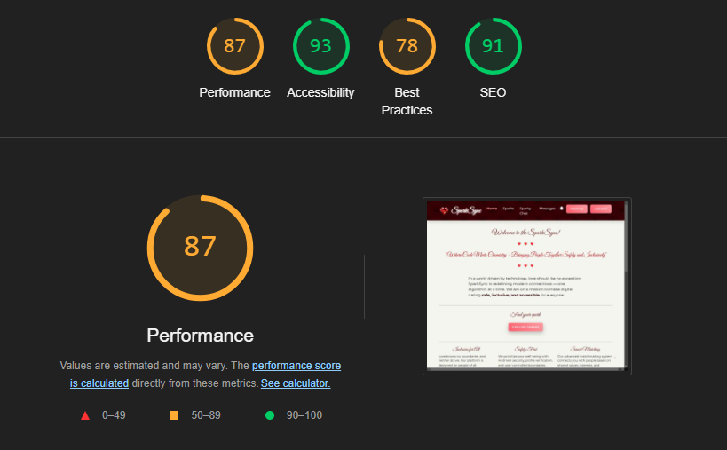
 |
| Chat            | 

Chat
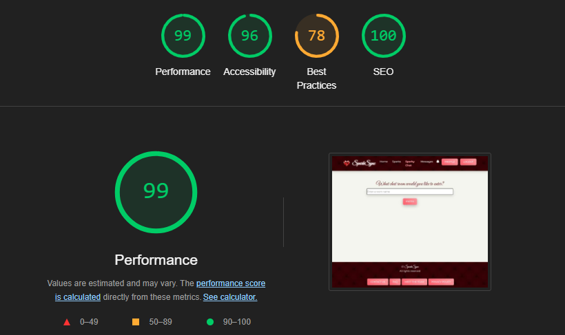
 |
| Contact         | 

Contact
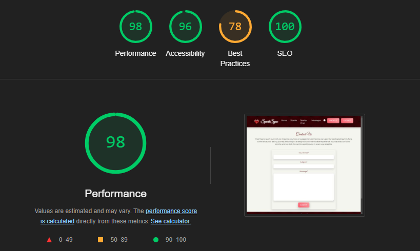
 |
| Inbox            | 

Inbox
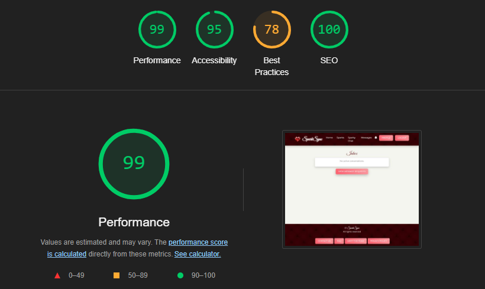
 |
| Message Req            | 

Message Req
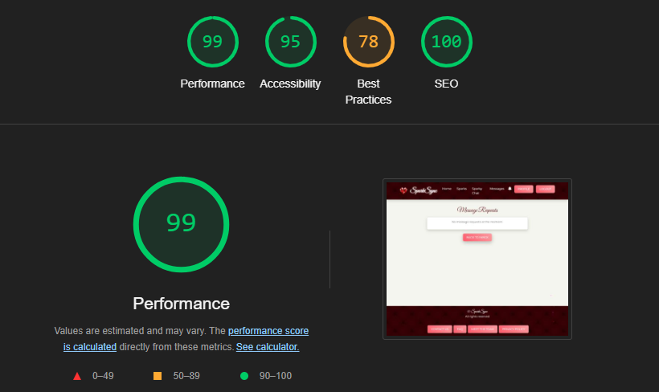
 |
| Sparks            | 

Sparks
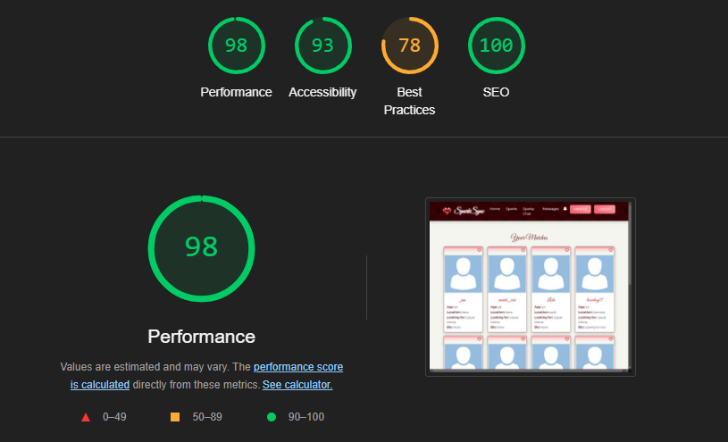
 |
| Team Page            | 

Team Page
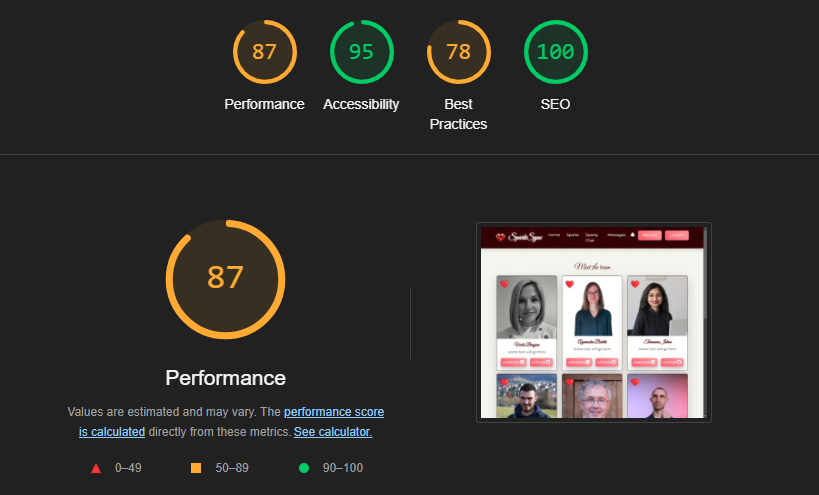
 |
| FAQ Page        | 

FAQ Page
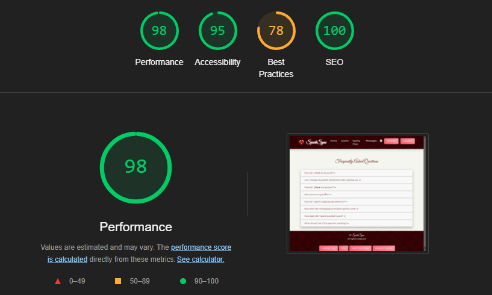
 |
| Policy Page            | 

Policy Page
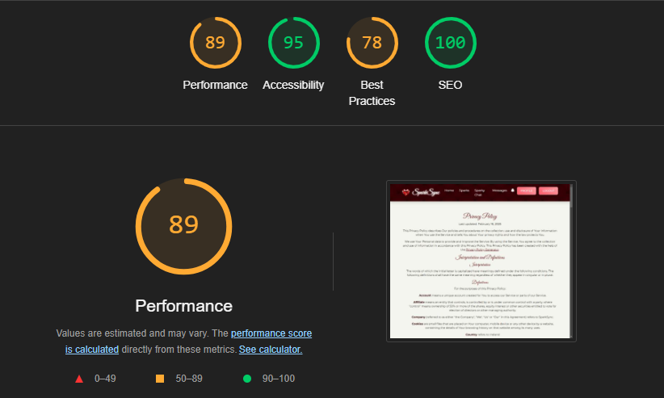
 |
| Create Profile         | 

Create Profile
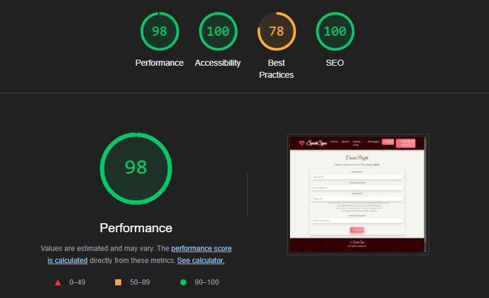
 |
| Profile            | 

Profile
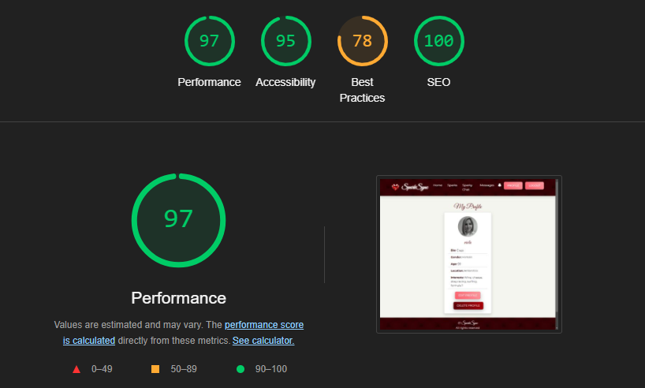
 |
| Login           | 

Login

 |
| Logout          | 

Logout
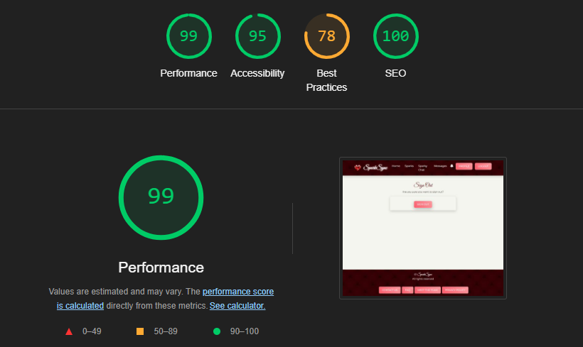
 |
|  |  |

 

| Page            |  Screenshot  |
| --------------- | ------------ |
| ***Mobile***   |              |
| Home            | 

Home
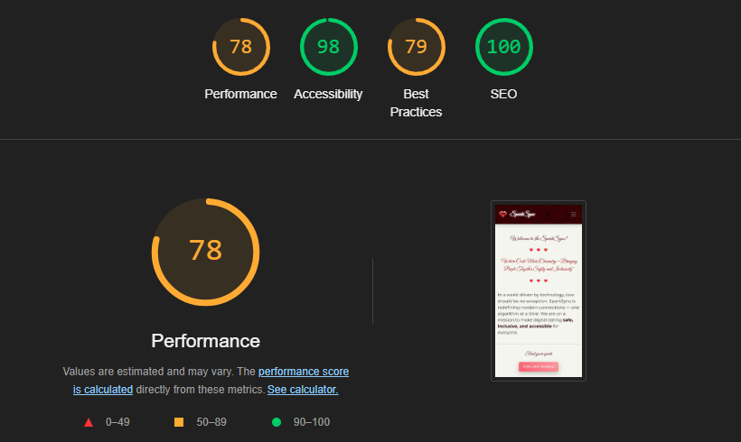
 |
| Chat            | 

Chat
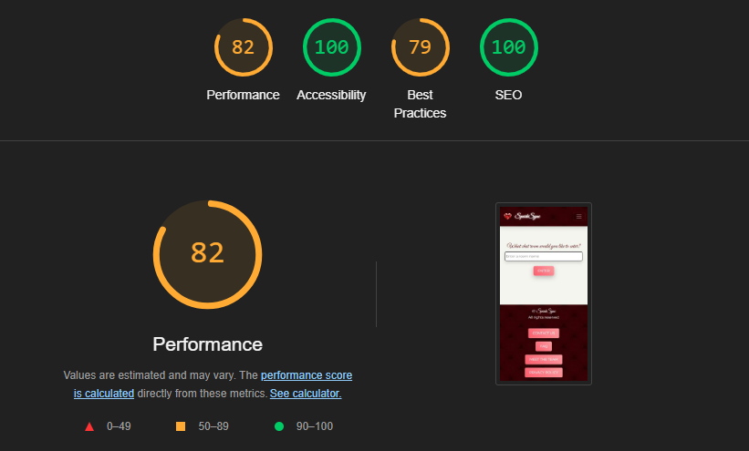
 |
| Contact         | 

Contact
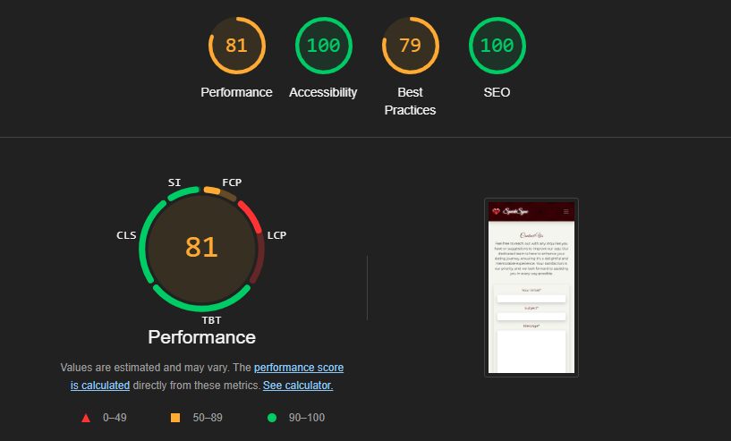
 |
| Inbox            | 

Inbox
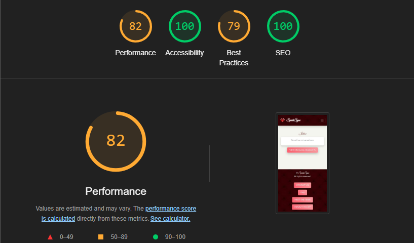
 |
| Message Req            | 

Message Req

 |
| Sparks            | 

Sparks
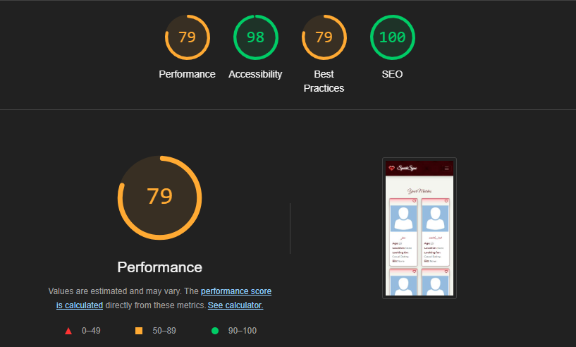
 |
| Team Page            | 

Team Page
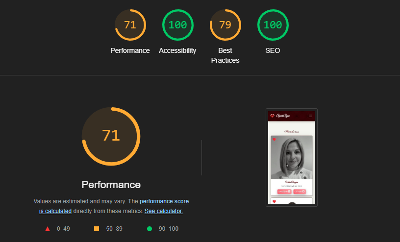
 |
| FAQ Page        | 

FAQ Page
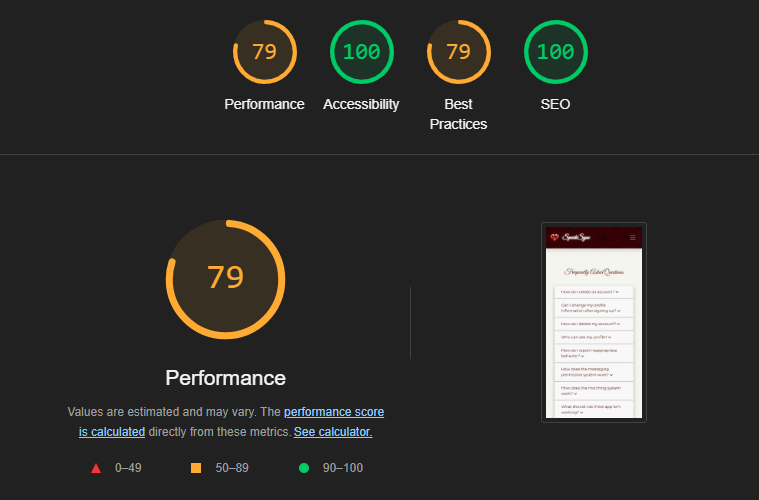
 |
| Policy Page            | 

Policy Page
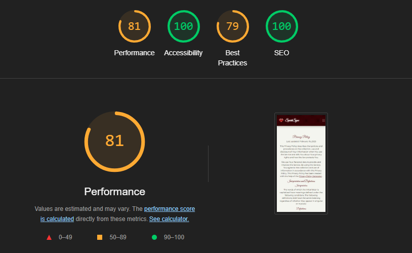
 |
| Create Profile         | 

Create Profile
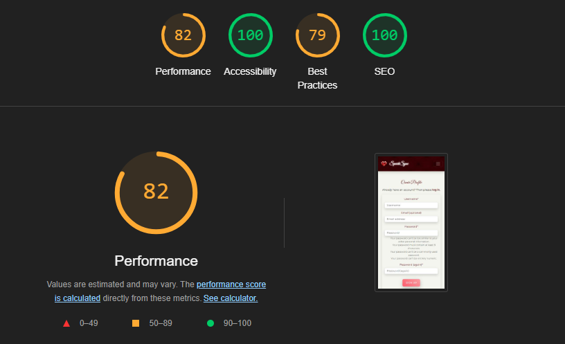
 |
| Profile            | 

Profile
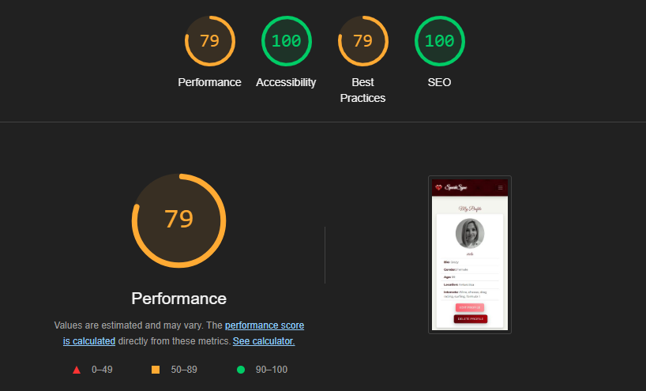
 |
| Login           | 

Login
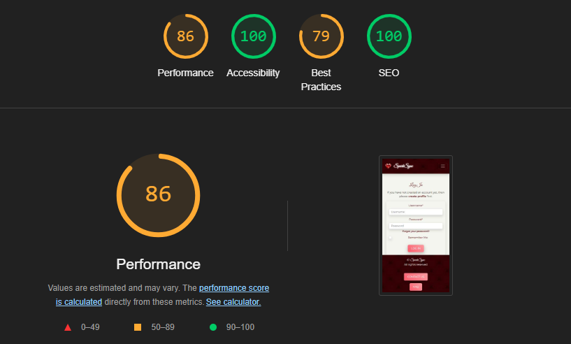
 |
| Logout          | 

Logout
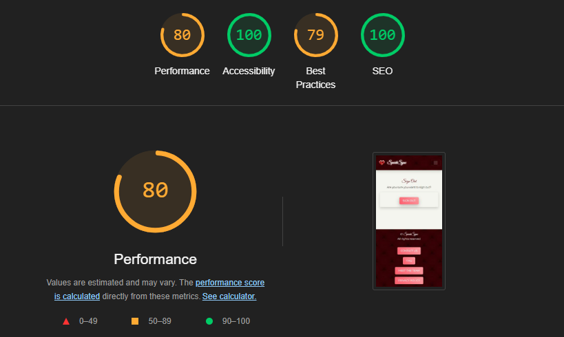
 |
|  |  |

## **Manual Testing**

### **Navigation**

| Element                | Action      | Expected Result                                         | Pass/Fail         |
| ---------------------- | ----------- | ------------------------------------------------------- | ----------------- |
| Logo                   | Click       | Redirect to Home page                                   | <mark></mark> |
| Home Link              | Click       | Redirect to Home page                                   | <mark></mark> |
| Register Link          | Click       | Redirect to sign up page                                | <mark></mark> |
| Log in Link            | Click       | Redirect to sign in page                                | <mark></mark> |
| Log out Link           | Click       | Redirect to log out page                                | <mark></mark> |
| Hamburger Menu         | Click       | Render a dropdown menu of all links                     | <mark></mark> |
| Footer Socials         | Click       | Redirect in a new tab to all respective media platforms | <mark></mark> |
| Register Link          | Display     | Render for non authenticated users                      | <mark></mark> |
| Log in Link            | Display     | Render for non authenticated users                      | <mark></mark> |
| Log out Link           | Display     | Render only if user is authenticated                    | <mark></mark> |

### Contact Page

| Element            | Action      | Expected Result                          | Pass/Fail         |
| ------------------ | ----------- | ---------------------------------------- | ----------------- |
| Contact form | Display | Allow user to contact admin by submitting form | <mark></mark> |
| Submit Button | Click | Submit contact form | <mark></mark> |
| Submit Button | Hover/Focus | Change  Background colour | <mark></mark> |

### Contact Success Page

| Element            | Action      | Expected Result                          | Pass/Fail         |
| ------------------ | ----------- | ---------------------------------------- | ----------------- |
| Back to Home Page Button | Click | Bring back to home page | <mark></mark> |
| Submit Button | Hover/Focus | Change  Background colour | <mark></mark> |

### Sign Up Page

| Element       | Action         | Expected Result                             | Pass/Fail         |
| ------------- | -------------- | ------------------------------------------- | ----------------- |
| Form(Valid)   | Submit         | Redirected to Home page                     | <mark></mark> |
| Form(Invalid) | Submit         | Error Context rendered to UI                | <mark></mark> |
| Login Link    | Click          | Redirect to Login Page                      | <mark></mark> |
| Logout Button   | Hover/Focus  | Change Background colour                    | <mark></mark> |

### Login Page

| Element       | Action         | Expected Result                             | Pass/Fail         |
| ------------- | -------------- | ------------------------------------------- | ----------------- |
| Form(Valid)   | Submit         | Redirected to Home page                     | <mark></mark> |
| Form(Valid)   | Submit         | Sign up in Notification received            | <mark></mark> |
| Form(Invalid) | Submit         | Error Context rendered to UI                | <mark></mark> |
| Sign Up Link | Click           | Redirect to Sign Up Page                    | <mark></mark> |
| Login Button  | Hover/Focus    | Change Background colour                    | <mark></mark> |

### Log Out Page

| Element       | Action         | Expected Result                                | Pass/Fail         |
| ------------- | -------------- | ---------------------------------------------- | ----------------- |
| Logout Button | Click          | User session is safely finished                | <mark></mark> |
| Logout Button | Click          | Redirected to Home page                        | <mark></mark> |
| Form Button   | Hover/Focus    | Change Background colour                       | <mark></mark> |

### Error Pages

| Element       | Action         | Expected Result                                | Pass/Fail         |
| ------------- | -------------- | ---------------------------------------------- | ----------------- |
| Back to Home Page Button   | Click    | Bring user back to home page     | <mark></mark> |
| Back to Home Page Button   | Hover/Focus    |    | <mark></mark> |

## **Responsiveness**

Responsiveness was achieved using Bootstrap and custom CSS and tested with Chrome DevTools making sure all pages adjust to screens starting from 320px wide. All screenshots can be found in [docs folder](static/docs/).

[Back to Readme](README.md)